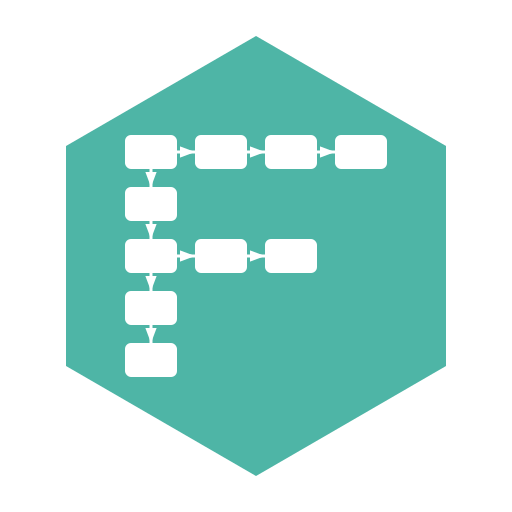
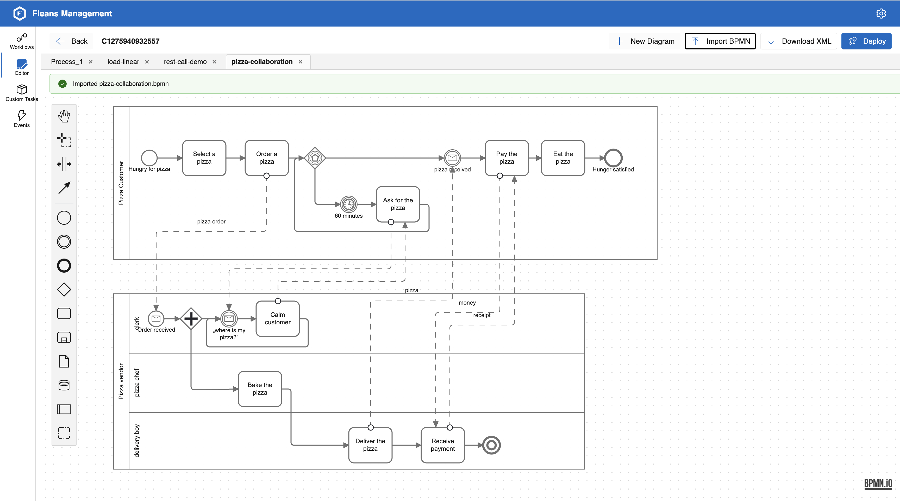

<p align="center">
  
</p>

<h1 align="center">Fleans</h1>

<p align="center">
  <b>BPMN workflows that survive crashes, retries, and restarts — built on Microsoft Orleans.</b>
</p>

<p align="center">
  <a href="https://github.com/nightBaker/fleans/actions/workflows/dotnet.yml"></a>
  <a href="LICENSE"></a>
  
  <a href="https://www.nuget.org/packages/Fleans.Worker"></a>
  <a href="https://github.com/nightBaker/fleans/stargazers"></a>
  <a href="https://nightbaker.github.io/fleans/"></a>
</p>

<p align="center">
  
</p>

---

Fleans is a **distributed BPMN 2.0 workflow engine** for .NET. Model business processes visually, deploy XML, and let Orleans handle the hard parts — durable state, clustering, retries, grain-level isolation. Long-running sagas, human-in-the-loop approvals, event-driven orchestration — without hand-rolling a state machine.

## Get running in 60 seconds

**Prerequisites:** .NET 10 SDK + Docker (Aspire boots a Redis container).

```bash
git clone https://github.com/nightBaker/fleans.git
cd fleans/src/Fleans
dotnet run --project Fleans.Aspire
```

Aspire boots the full dev stack — `Fleans.Api` (Orleans silo), `Fleans.Web` (Blazor admin), and Redis — then opens the dashboard with live logs, distributed tracing, and the Orleans Dashboard pre-wired. The admin UI is on the `Fleans.Web` endpoint.

For **production deployments** (Docker Compose, Kubernetes/Helm, bare VM), follow the [self-host guides](https://nightbaker.github.io/fleans/reference/self-hosting/) on the docs site.

## Why Fleans

|   |   |
|---|---|
| **BPMN-native** | Deploy raw BPMN 2.0 XML straight from Camunda Modeler or the built-in editor. Coverage includes start/end events (timer, message, signal, error), exclusive / parallel / event-based gateways, script tasks, call activities, sub-processes, boundary events, and compensation. |
| **Built on Orleans** | Each running workflow is a virtual actor (grain). Single-threaded execution, persistent state, automatic placement — and the cluster scales horizontally by adding silos. |
| **Durable by design** | `WorkflowInstance` is event-sourced (`JournaledGrain` + CQRS read projections). Crashes mid-step recover from the journal, not a half-written row. |
| **Plugin model for custom tasks** | Write a class deriving from `CustomTaskHandlerBase`, register it in DI, deploy a Worker silo. No engine recompile. The REST caller plugin ships as a worked example. |
| **Aspire-first dev loop** | One command boots Api + Web + Redis with the Aspire dashboard, live logs, distributed tracing, and the Orleans Dashboard. No docker-compose juggling during development. |
| **Multi-silo streaming** | Memory streams for dev; Kafka and Azure Queue Storage for production. Workflow event subscribers run on any silo — placement is Orleans-native, not pinned. |
| **CQRS persistence** | EF Core split into `FleanCommandDbContext` (writes) and `FleanQueryDbContext` (no-tracking reads). SQLite for dev, PostgreSQL for production — same code path. |
| **Visual editor + admin UI** | Multi-tab `bpmn-js` editor, live deployment, instance state inspector, manual message/signal correlation. Blazor Server — no separate frontend deploy. |

## Deploy a workflow in 10 lines

```xml
<?xml version="1.0" encoding="UTF-8"?>
<definitions xmlns="http://www.omg.org/spec/BPMN/20100524/MODEL">
  <process id="simple-workflow" isExecutable="true">
    <startEvent id="start" />
    <scriptTask id="task1" scriptFormat="csharp">
      <script>_context.done = true</script>
    </scriptTask>
    <endEvent id="end" />
    <sequenceFlow id="f1" sourceRef="start" targetRef="task1" />
    <sequenceFlow id="f2" sourceRef="task1" targetRef="end" />
  </process>
</definitions>
```

POST to `/workflows/upload-bpmn`, then `/workflows/start` with the process ID. The script body has access to `_context` — set variables, read inputs, and the engine merges them into the instance state on completion. See the [Quick start guide](https://nightbaker.github.io/fleans/guides/quick-start/) for the full walkthrough.

## Architecture

Fleans follows Clean Architecture / DDD with a CQRS split. Each layer is a separate project; references flow inward.

- **`Fleans.Domain`** — pure C# records and activity logic. Zero infra. Defines `IActivityExecutionContext`, `IWorkflowExecutionContext`, and the BPMN element classes.
- **`Fleans.Application`** — Orleans grains: `WorkflowInstance` (event-sourced via `JournaledGrain`), `WorkflowInstanceFactoryGrain`, effect handlers for timers / messages / signals.
- **`Fleans.Worker`** — `[StatelessWorker]` grains for script evaluation, condition expressions, and custom-task plugin handlers. Deployable separately as `Fleans.WorkerHost`.
- **`Fleans.Infrastructure`** — `BpmnConverter` (XML → domain), `DynamicExpressoConditionExpressionEvaluator`. The translation boundary.
- **`Fleans.Persistence` + `Fleans.Persistence.{Sqlite,PostgreSql}`** — CQRS-split EF Core grain storage and read projections. SQLite for dev, PostgreSQL for production.
- **`Fleans.Api`** — REST surface (`WorkflowController`: upload-bpmn / start / register), Orleans silo host. Role-aware: `Core` / `Worker` / `Combined`.
- **`Fleans.Web`** — Blazor Server admin panel (Fluent UI). Calls grains directly via the Orleans client — no API hop.
- **`Fleans.Aspire`** — .NET Aspire AppHost. Dev orchestration in 3-process mode; `aspire publish` emits Api + Web + Worker + Mcp deployments for Compose or Kubernetes.

→ [Architecture deep-dive](https://nightbaker.github.io/fleans/concepts/architecture/) on the docs site.

## BPMN coverage

The authoritative element coverage matrix lives on the docs site:
**[nightbaker.github.io/fleans/concepts/bpmn-support](https://nightbaker.github.io/fleans/concepts/bpmn-support/)** — status (✅ / ⚠️ / 🚧 / ❌) per element variant, source-line pins to `BpmnConverter.cs`, and a manual-test fixture exercising each element end-to-end.

## Documentation

- [Quick start](https://nightbaker.github.io/fleans/guides/quick-start/) — first workflow in five minutes
- [BPMN editor](https://nightbaker.github.io/fleans/guides/editor/) — multi-tab editing, live deploy
- [Writing custom tasks](https://nightbaker.github.io/fleans/guides/writing-custom-tasks/) — your own task plugins
- [Custom worker host](https://nightbaker.github.io/fleans/guides/custom-worker-host/) — ship plugins as a separate deployable
- [Message correlation](https://nightbaker.github.io/fleans/guides/message-correlation/) — wire BPMN to external events
- [Error handling](https://nightbaker.github.io/fleans/guides/error-handling/) — boundary events and compensation
- [Self-host: Docker Compose](https://nightbaker.github.io/fleans/guides/self-host-docker-compose/) · [Helm](https://nightbaker.github.io/fleans/guides/self-host-helm/)
- [API reference](https://nightbaker.github.io/fleans/reference/api/) · [Configuration](https://nightbaker.github.io/fleans/reference/configuration/) · [Observability](https://nightbaker.github.io/fleans/reference/observability/)

## Use cases

- **Long-running order fulfillment** — multi-day workflows with pauses for human approval, timer escalation, and compensation on rollback.
- **Event-driven sagas** — receive Kafka messages, branch on payload, throw signals to other instances.
- **Approval pipelines** — human tasks with deadlines, boundary timers for escalation, and full audit trail from event sourcing.
- **Scheduled batch jobs** — timer-start workflows that drive nightly ETL or report generation.

## Contributing

Issues and PRs welcome. Branch off `main` (`feature/<name>` or `fix/<name>`), open a PR back — CI runs build + test on every PR.

For larger changes, open an issue first to align on the design. Design docs live under [`docs/plans/`](docs/plans/), and the contributor handbook lives in [`CLAUDE.md`](CLAUDE.md) at the repo root — build commands, conventions, layer ownership, and lessons learned.

## License

Fleans is licensed under **[PolyForm Noncommercial 1.0.0](LICENSE)** — source-available, free for non-commercial use (personal, research, evaluation, internal at non-profits). For commercial deployment, contact the maintainer for a commercial license.

PolyForm Noncommercial is a tech-industry-lawyer-drafted source-available licence — see [polyformproject.org](https://polyformproject.org/licenses/noncommercial/1.0.0/). It keeps the source open for inspection, learning, and contribution while reserving commercial revenue to fund sustained development.
