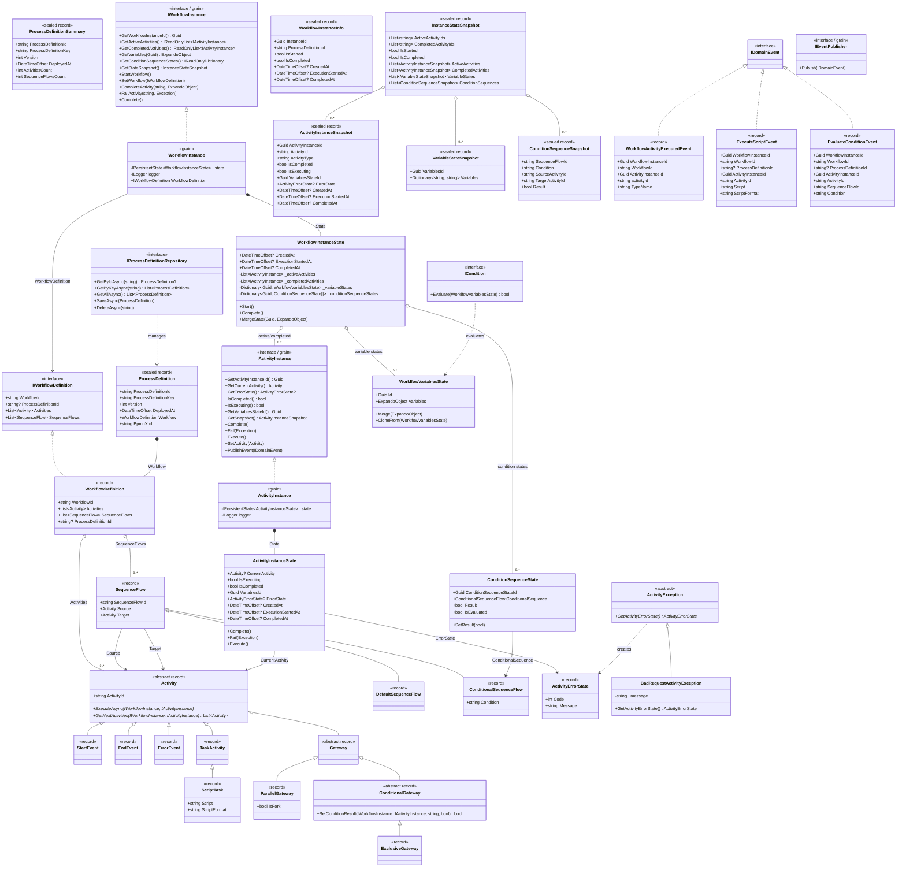

# Domain Models Diagram

```mermaid
classDiagram
    direction TB

    %% ─────────────────────────────────────────────
    %% ACTIVITY HIERARCHY
    %% ─────────────────────────────────────────────
    class Activity {
        <<abstract record>>
        +string ActivityId
        +ExecuteAsync(IWorkflowInstance, IActivityInstance)*
        +GetNextActivities(IWorkflowInstance, IActivityInstance)* List~Activity~
    }

    class StartEvent {
        <<record>>
    }

    class EndEvent {
        <<record>>
    }

    class ErrorEvent {
        <<record>>
    }

    class TaskActivity {
        <<record>>
    }

    class ScriptTask {
        <<record>>
        +string Script
        +string ScriptFormat
    }

    class Gateway {
        <<abstract record>>
    }

    class ParallelGateway {
        <<record>>
        +bool IsFork
    }

    class ConditionalGateway {
        <<abstract record>>
        +SetConditionResult(IWorkflowInstance, IActivityInstance, string, bool) bool
    }

    class ExclusiveGateway {
        <<record>>
    }

    Activity <|-- StartEvent
    Activity <|-- EndEvent
    Activity <|-- ErrorEvent
    Activity <|-- TaskActivity
    TaskActivity <|-- ScriptTask
    Activity <|-- Gateway
    Gateway <|-- ParallelGateway
    Gateway <|-- ConditionalGateway
    ConditionalGateway <|-- ExclusiveGateway

    %% ─────────────────────────────────────────────
    %% WORKFLOW DEFINITION
    %% ─────────────────────────────────────────────
    class IWorkflowDefinition {
        <<interface>>
        +string WorkflowId
        +string? ProcessDefinitionId
        +List~Activity~ Activities
        +List~SequenceFlow~ SequenceFlows
    }

    class WorkflowDefinition {
        <<record>>
        +string WorkflowId
        +List~Activity~ Activities
        +List~SequenceFlow~ SequenceFlows
        +string? ProcessDefinitionId
    }

    class ProcessDefinition {
        <<sealed record>>
        +string ProcessDefinitionId
        +string ProcessDefinitionKey
        +int Version
        +DateTimeOffset DeployedAt
        +WorkflowDefinition Workflow
        +string BpmnXml
    }

    class ProcessDefinitionSummary {
        <<sealed record>>
        +string ProcessDefinitionId
        +string ProcessDefinitionKey
        +int Version
        +DateTimeOffset DeployedAt
        +int ActivitiesCount
        +int SequenceFlowsCount
    }

    IWorkflowDefinition <|.. WorkflowDefinition
    ProcessDefinition *-- WorkflowDefinition : Workflow
    WorkflowDefinition o-- "0..*" Activity : Activities
    WorkflowDefinition o-- "0..*" SequenceFlow : SequenceFlows

    %% ─────────────────────────────────────────────
    %% SEQUENCE FLOWS
    %% ─────────────────────────────────────────────
    class SequenceFlow {
        <<record>>
        +string SequenceFlowId
        +Activity Source
        +Activity Target
    }

    class DefaultSequenceFlow {
        <<record>>
    }

    class ConditionalSequenceFlow {
        <<record>>
        +string Condition
    }

    SequenceFlow <|-- DefaultSequenceFlow
    SequenceFlow <|-- ConditionalSequenceFlow
    SequenceFlow --> Activity : Source
    SequenceFlow --> Activity : Target

    %% ─────────────────────────────────────────────
    %% WORKFLOW INSTANCE (Grain)
    %% ─────────────────────────────────────────────
    class IWorkflowInstance {
        <<interface / grain>>
        +GetWorkflowInstanceId() Guid
        +GetActiveActivities() IReadOnlyList~IActivityInstance~
        +GetCompletedActivities() IReadOnlyList~IActivityInstance~
        +GetVariables(Guid) ExpandoObject
        +GetConditionSequenceStates() IReadOnlyDictionary
        +GetStateSnapshot() InstanceStateSnapshot
        +StartWorkflow()
        +SetWorkflow(IWorkflowDefinition)
        +CompleteActivity(string, ExpandoObject)
        +FailActivity(string, Exception)
        +Complete()
    }

    class WorkflowInstance {
        <<grain>>
        -IPersistentState~WorkflowInstanceState~ _state
        -ILogger logger
        +IWorkflowDefinition WorkflowDefinition
    }

    class WorkflowInstanceState {
        +DateTimeOffset? CreatedAt
        +DateTimeOffset? ExecutionStartedAt
        +DateTimeOffset? CompletedAt
        -List~IActivityInstance~ _activeActivities
        -List~IActivityInstance~ _completedActivities
        -Dictionary~Guid, WorklfowVariablesState~ _variableStates
        -Dictionary~Guid, ConditionSequenceState[]~ _conditionSequenceStates
        +Start()
        +Complete()
        +MergeState(Guid, ExpandoObject)
    }

    class WorkflowInstanceInfo {
        <<sealed record>>
        +Guid InstanceId
        +string ProcessDefinitionId
        +bool IsStarted
        +bool IsCompleted
        +DateTimeOffset? CreatedAt
        +DateTimeOffset? ExecutionStartedAt
        +DateTimeOffset? CompletedAt
    }

    class InstanceStateSnapshot {
        <<sealed record>>
        +List~string~ ActiveActivityIds
        +List~string~ CompletedActivityIds
        +bool IsStarted
        +bool IsCompleted
        +List~ActivityInstanceSnapshot~ ActiveActivities
        +List~ActivityInstanceSnapshot~ CompletedActivities
        +List~VariableStateSnapshot~ VariableStates
        +List~ConditionSequenceSnapshot~ ConditionSequences
    }

    IWorkflowInstance <|.. WorkflowInstance
    WorkflowInstance *-- WorkflowInstanceState : State
    WorkflowInstance --> IWorkflowDefinition : WorkflowDefinition
    WorkflowInstanceState o-- "0..*" IActivityInstance : active/completed
    WorkflowInstanceState o-- "0..*" WorklfowVariablesState : variable states
    WorkflowInstanceState o-- "0..*" ConditionSequenceState : condition states

    %% ─────────────────────────────────────────────
    %% ACTIVITY INSTANCE (Grain)
    %% ─────────────────────────────────────────────
    class IActivityInstance {
        <<interface / grain>>
        +GetActivityInstanceId() Guid
        +GetCurrentActivity() Activity
        +GetErrorState() ActivityErrorState?
        +IsCompleted() bool
        +IsExecuting() bool
        +GetVariablesStateId() Guid
        +GetSnapshot() ActivityInstanceSnapshot
        +Complete()
        +Fail(Exception)
        +Execute()
        +SetActivity(Activity)
        +PublishEvent(IDomainEvent)
    }

    class ActivityInstance {
        <<grain>>
        -IPersistentState~ActivityInstanceState~ _state
        -ILogger logger
    }

    class ActivityInstanceState {
        +Activity? CurrentActivity
        +bool IsExecuting
        +bool IsCompleted
        +Guid VariablesId
        +ActivityErrorState? ErrorState
        +DateTimeOffset? CreatedAt
        +DateTimeOffset? ExecutionStartedAt
        +DateTimeOffset? CompletedAt
        +Complete()
        +Fail(Exception)
        +Execute()
    }

    class ActivityErrorState {
        <<record>>
        +int Code
        +string Message
    }

    class ActivityInstanceSnapshot {
        <<sealed record>>
        +Guid ActivityInstanceId
        +string ActivityId
        +string ActivityType
        +bool IsCompleted
        +bool IsExecuting
        +Guid VariablesStateId
        +ActivityErrorState? ErrorState
        +DateTimeOffset? CreatedAt
        +DateTimeOffset? ExecutionStartedAt
        +DateTimeOffset? CompletedAt
    }

    IActivityInstance <|.. ActivityInstance
    ActivityInstance *-- ActivityInstanceState : State
    ActivityInstanceState --> Activity : CurrentActivity
    ActivityInstanceState --> ActivityErrorState : ErrorState

    %% ─────────────────────────────────────────────
    %% VARIABLES & CONDITIONS STATE
    %% ─────────────────────────────────────────────
    class WorklfowVariablesState {
        +Guid Id
        +ExpandoObject Variables
        +Merge(ExpandoObject)
        +CloneFrom(WorklfowVariablesState)
    }

    class ConditionSequenceState {
        +Guid ConditionSequenceStateId
        +ConditionalSequenceFlow ConditionalSequence
        +bool Result
        +bool IsEvaluated
        +SetResult(bool)
    }

    class VariableStateSnapshot {
        <<sealed record>>
        +Guid VariablesId
        +Dictionary~string, string~ Variables
    }

    class ConditionSequenceSnapshot {
        <<sealed record>>
        +string SequenceFlowId
        +string Condition
        +string SourceActivityId
        +string TargetActivityId
        +bool Result
    }

    ConditionSequenceState --> ConditionalSequenceFlow : ConditionalSequence

    %% ─────────────────────────────────────────────
    %% DOMAIN EVENTS
    %% ─────────────────────────────────────────────
    class IDomainEvent {
        <<interface>>
    }

    class WorkflowActivityExecutedEvent {
        <<record>>
        +Guid WorkflowInstanceId
        +string WorkflowId
        +Guid ActivityInstanceId
        +string activityId
        +string TypeName
    }

    class ExecuteScriptEvent {
        <<record>>
        +Guid WorkflowInstanceId
        +string WorkflowId
        +string? ProcessDefinitionId
        +Guid ActivityInstanceId
        +string ActivityId
        +string Script
        +string ScriptFormat
    }

    class EvaluateConditionEvent {
        <<record>>
        +Guid WorkflowInstanceId
        +string WorkflowId
        +string? ProcessDefinitionId
        +Guid ActivityInstanceId
        +string ActivityId
        +string SequenceFlowId
        +string Condition
    }

    class IEventPublisher {
        <<interface / grain>>
        +Publish(IDomainEvent)
    }

    IDomainEvent <|.. WorkflowActivityExecutedEvent
    IDomainEvent <|.. ExecuteScriptEvent
    IDomainEvent <|.. EvaluateConditionEvent

    %% ─────────────────────────────────────────────
    %% ERRORS
    %% ─────────────────────────────────────────────
    class ActivityException {
        <<abstract>>
        +GetActivityErrorState()* ActivityErrorState
    }

    class BadRequestActivityException {
        -string _message
        +GetActivityErrorState() ActivityErrorState
    }

    ActivityException <|-- BadRequestActivityException
    ActivityException ..> ActivityErrorState : creates

    %% ─────────────────────────────────────────────
    %% PERSISTENCE
    %% ─────────────────────────────────────────────
    class IProcessDefinitionRepository {
        <<interface>>
        +GetByIdAsync(string) ProcessDefinition?
        +GetByKeyAsync(string) List~ProcessDefinition~
        +GetAllAsync() List~ProcessDefinition~
        +SaveAsync(ProcessDefinition)
        +DeleteAsync(string)
    }

    IProcessDefinitionRepository ..> ProcessDefinition : manages

    %% ─────────────────────────────────────────────
    %% CONDITION
    %% ─────────────────────────────────────────────
    class ICondition {
        <<interface>>
        +Evaluate(WorklfowVariablesState) bool
    }

    ICondition ..> WorklfowVariablesState : evaluates

    %% ─────────────────────────────────────────────
    %% SNAPSHOT RELATIONSHIPS
    %% ─────────────────────────────────────────────
    InstanceStateSnapshot o-- "0..*" ActivityInstanceSnapshot
    InstanceStateSnapshot o-- "0..*" VariableStateSnapshot
    InstanceStateSnapshot o-- "0..*" ConditionSequenceSnapshot
```
