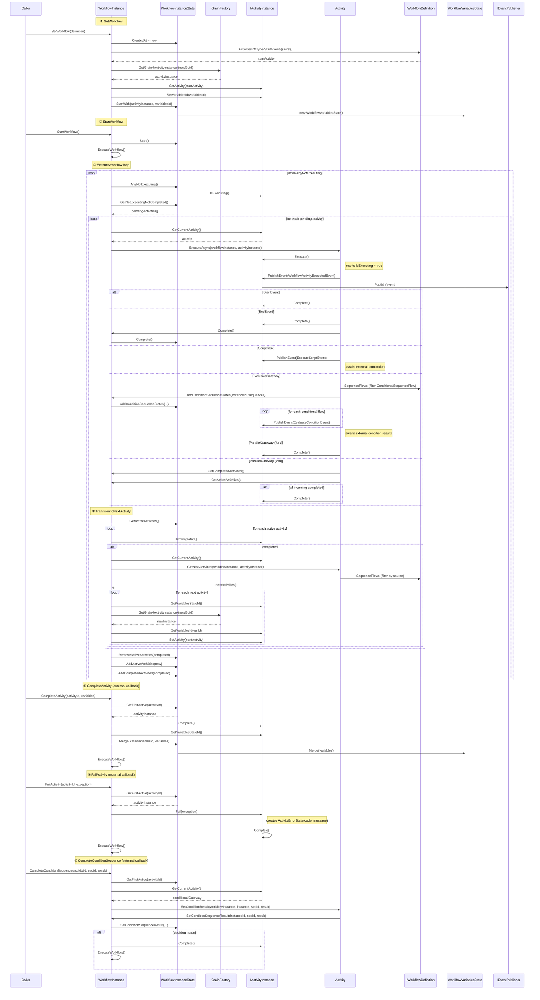

# WorkflowInstance Call Diagram

## Call graph — every interaction from WorkflowInstance to domain models

```mermaid
flowchart TB
    subgraph WI["WorkflowInstance (Grain)"]
        SetWorkflow["SetWorkflow()"]
        StartWorkflow["StartWorkflow()"]
        ExecuteWorkflow["ExecuteWorkflow()"]
        CompleteActivity["CompleteActivity()"]
        FailActivity["FailActivity()"]
        CompleteCondSeq["CompleteConditionSequence()"]
        TransitionNext["TransitionToNextActivity()"]
        CompActState["CompleteActivityState()"]
        FailActState["FailActivityState()"]
        Complete["Complete()"]
        GetInstanceInfo["GetInstanceInfo()"]
        GetStateSnapshot["GetStateSnapshot()"]
        GetVariables["GetVariables()"]
    end

    subgraph State["WorkflowInstanceState"]
        S_Start["Start()"]
        S_Complete["Complete()"]
        S_StartWith["StartWith()"]
        S_GetActive["GetActiveActivities()"]
        S_GetCompleted["GetCompletedActivities()"]
        S_GetFirstActive["GetFirstActive()"]
        S_AnyNotExec["AnyNotExecuting()"]
        S_GetNotExec["GetNotExecutingNotCompleted()"]
        S_RemoveActive["RemoveActiveActivities()"]
        S_AddActive["AddActiveActivities()"]
        S_AddCompleted["AddCompletedActivities()"]
        S_MergeState["MergeState()"]
        S_AddCondSeq["AddConditionSequenceStates()"]
        S_SetCondRes["SetConditionSequenceResult()"]
        S_GetVarStates["GetVariableStates()"]
        S_GetSnapshot["GetStateSnapshot()"]
        S_IsStarted["IsStarted()"]
        S_IsCompleted["IsCompleted()"]
    end

    subgraph AI["IActivityInstance (Grain)"]
        AI_Execute["Execute()"]
        AI_Complete["Complete()"]
        AI_Fail["Fail()"]
        AI_SetActivity["SetActivity()"]
        AI_SetVarId["SetVariablesId()"]
        AI_GetCurrent["GetCurrentActivity()"]
        AI_IsCompleted["IsCompleted()"]
        AI_IsExecuting["IsExecuting()"]
        AI_GetVarId["GetVariablesStateId()"]
        AI_GetSnapshot["GetSnapshot()"]
        AI_Publish["PublishEvent()"]
        AI_GetId["GetActivityInstanceId()"]
    end

    subgraph Acts["Activity Hierarchy"]
        A_Execute["Activity.ExecuteAsync()"]
        A_GetNext["Activity.GetNextActivities()"]
        SE_Execute["StartEvent.ExecuteAsync()"]
        EE_Execute["EndEvent.ExecuteAsync()"]
        ST_Execute["ScriptTask.ExecuteAsync()"]
        EG_Execute["ExclusiveGateway.ExecuteAsync()"]
        PG_Execute["ParallelGateway.ExecuteAsync()"]
        CG_SetCond["ConditionalGateway.SetConditionResult()"]
    end

    subgraph Vars["Variable State"]
        VS_Merge["WorklfowVariablesState.Merge()"]
        VS_Variables["WorklfowVariablesState.Variables"]
    end

    subgraph CondState["Condition State"]
        CS_SetResult["ConditionSequenceState.SetResult()"]
    end

    subgraph SeqFlows["Sequence Flows"]
        SF_Conditional["ConditionalSequenceFlow"]
        SF_Default["DefaultSequenceFlow"]
    end

    subgraph Events["Domain Events"]
        Ev_Executed["WorkflowActivityExecutedEvent"]
        Ev_Script["ExecuteScriptEvent"]
        Ev_Condition["EvaluateConditionEvent"]
    end

    subgraph Factory["IGrainFactory"]
        GF_GetGrain["GetGrain~IActivityInstance~()"]
    end

    subgraph Def["IWorkflowDefinition"]
        Def_Activities["Activities"]
        Def_SeqFlows["SequenceFlows"]
        Def_WorkflowId["WorkflowId"]
        Def_ProcDefId["ProcessDefinitionId"]
    end

    subgraph Snapshots["Snapshots"]
        Snap_Instance["InstanceStateSnapshot"]
        Snap_Activity["ActivityInstanceSnapshot"]
        Snap_Var["VariableStateSnapshot"]
        Snap_Cond["ConditionSequenceSnapshot"]
    end

    subgraph Errors["Errors"]
        AErr_State["ActivityErrorState"]
        AErr_Exception["ActivityException"]
    end

    %% ──────────────────────────────────
    %% SetWorkflow
    %% ──────────────────────────────────
    SetWorkflow -->|"store definition"| Def
    SetWorkflow -->|"find StartEvent"| Def_Activities
    SetWorkflow -->|"create start grain"| GF_GetGrain
    SetWorkflow -->|"configure grain"| AI_SetActivity
    SetWorkflow -->|"configure grain"| AI_SetVarId
    SetWorkflow -->|"init state"| S_StartWith

    %% ──────────────────────────────────
    %% StartWorkflow
    %% ──────────────────────────────────
    StartWorkflow -->|"mark started"| S_Start
    StartWorkflow --> ExecuteWorkflow

    %% ──────────────────────────────────
    %% ExecuteWorkflow (loop)
    %% ──────────────────────────────────
    ExecuteWorkflow -->|"check loop"| S_AnyNotExec
    S_AnyNotExec -.->|"for each active"| AI_IsExecuting
    ExecuteWorkflow -->|"get pending"| S_GetNotExec
    ExecuteWorkflow -->|"get activity type"| AI_GetCurrent
    ExecuteWorkflow -->|"polymorphic call"| A_Execute
    ExecuteWorkflow --> TransitionNext

    %% ──────────────────────────────────
    %% Activity.ExecuteAsync (base)
    %% ──────────────────────────────────
    A_Execute -->|"mark executing"| AI_Execute
    A_Execute -->|"publish"| AI_Publish
    AI_Publish -.-> Ev_Executed

    %% ──────────────────────────────────
    %% StartEvent override
    %% ──────────────────────────────────
    SE_Execute -->|"base"| A_Execute
    SE_Execute -->|"auto-complete"| AI_Complete

    %% ──────────────────────────────────
    %% EndEvent override
    %% ──────────────────────────────────
    EE_Execute -->|"base"| A_Execute
    EE_Execute -->|"complete activity"| AI_Complete
    EE_Execute -->|"complete workflow"| Complete

    %% ──────────────────────────────────
    %% ScriptTask override
    %% ──────────────────────────────────
    ST_Execute -->|"base"| A_Execute
    ST_Execute -->|"publish"| AI_Publish
    AI_Publish -.-> Ev_Script

    %% ──────────────────────────────────
    %% ExclusiveGateway override
    %% ──────────────────────────────────
    EG_Execute -->|"base"| A_Execute
    EG_Execute -->|"read"| Def_SeqFlows
    EG_Execute -.->|"filter"| SF_Conditional
    EG_Execute -->|"store conditions"| S_AddCondSeq
    EG_Execute -->|"publish per condition"| AI_Publish
    AI_Publish -.-> Ev_Condition

    %% ──────────────────────────────────
    %% ParallelGateway override
    %% ──────────────────────────────────
    PG_Execute -->|"base"| A_Execute
    PG_Execute -->|"check completed paths"| S_GetCompleted
    PG_Execute -->|"check active paths"| S_GetActive
    PG_Execute -->|"fork: auto-complete"| AI_Complete

    %% ──────────────────────────────────
    %% TransitionToNextActivity
    %% ──────────────────────────────────
    TransitionNext -->|"list active"| S_GetActive
    TransitionNext -->|"check done"| AI_IsCompleted
    TransitionNext -->|"get type"| AI_GetCurrent
    TransitionNext -->|"resolve next"| A_GetNext
    A_GetNext -.->|"reads"| Def_SeqFlows
    TransitionNext -->|"get var scope"| AI_GetVarId
    TransitionNext -->|"create grain"| GF_GetGrain
    TransitionNext -->|"set activity"| AI_SetActivity
    TransitionNext -->|"set var scope"| AI_SetVarId
    TransitionNext -->|"remove done"| S_RemoveActive
    TransitionNext -->|"add new"| S_AddActive
    TransitionNext -->|"archive"| S_AddCompleted

    %% ──────────────────────────────────
    %% CompleteActivity
    %% ──────────────────────────────────
    CompleteActivity --> CompActState
    CompleteActivity --> ExecuteWorkflow
    CompActState -->|"find active"| S_GetFirstActive
    CompActState -->|"mark complete"| AI_Complete
    CompActState -->|"get var scope"| AI_GetVarId
    CompActState -->|"merge variables"| S_MergeState
    S_MergeState -->|"merge into state"| VS_Merge

    %% ──────────────────────────────────
    %% FailActivity
    %% ──────────────────────────────────
    FailActivity --> FailActState
    FailActivity --> ExecuteWorkflow
    FailActState -->|"find active"| S_GetFirstActive
    FailActState -->|"fail + complete"| AI_Fail
    AI_Fail -.->|"creates"| AErr_State
    AI_Fail -.->|"reads code from"| AErr_Exception

    %% ──────────────────────────────────
    %% CompleteConditionSequence
    %% ──────────────────────────────────
    CompleteCondSeq -->|"find active"| S_GetFirstActive
    CompleteCondSeq -->|"get gateway"| AI_GetCurrent
    CompleteCondSeq -->|"evaluate"| CG_SetCond
    CG_SetCond -->|"store result"| S_SetCondRes
    S_SetCondRes -.-> CS_SetResult
    CG_SetCond -->|"check default"| Def_SeqFlows
    CG_SetCond -.->|"fallback"| SF_Default
    CompleteCondSeq -->|"auto-complete"| AI_Complete
    CompleteCondSeq --> ExecuteWorkflow

    %% ──────────────────────────────────
    %% Complete
    %% ──────────────────────────────────
    Complete -->|"mark completed"| S_Complete

    %% ──────────────────────────────────
    %% GetInstanceInfo
    %% ──────────────────────────────────
    GetInstanceInfo -->|"read"| S_IsStarted
    GetInstanceInfo -->|"read"| S_IsCompleted
    GetInstanceInfo -->|"read"| Def_ProcDefId

    %% ──────────────────────────────────
    %% GetStateSnapshot
    %% ──────────────────────────────────
    GetStateSnapshot --> S_GetSnapshot
    S_GetSnapshot -->|"per activity"| AI_GetSnapshot
    AI_GetSnapshot -.-> Snap_Activity
    S_GetSnapshot -.-> Snap_Instance
    S_GetSnapshot -.-> Snap_Var
    S_GetSnapshot -.-> Snap_Cond

    %% ──────────────────────────────────
    %% GetVariables
    %% ──────────────────────────────────
    GetVariables -->|"lookup"| S_GetVarStates
    S_GetVarStates -.-> VS_Variables

    %% ──────────────────────────────────
    %% Styles
    %% ──────────────────────────────────
    style WI fill:#4a90d9,color:#fff
    style State fill:#7fb685,color:#fff
    style AI fill:#d98c4a,color:#fff
    style Acts fill:#c27ab5,color:#fff
    style Vars fill:#8bc4c1,color:#fff
    style CondState fill:#8bc4c1,color:#fff
    style SeqFlows fill:#d4c76a,color:#333
    style Events fill:#b07ad4,color:#fff
    style Factory fill:#999,color:#fff
    style Def fill:#6a8fd4,color:#fff
    style Snapshots fill:#aaa,color:#fff
    style Errors fill:#d46a6a,color:#fff
```

## Sequence diagram — main workflow lifecycle

```mermaid
sequenceDiagram
    participant Caller
    participant WI as WorkflowInstance
    participant WIS as WorkflowInstanceState
    participant GF as GrainFactory
    participant AI as IActivityInstance
    participant Act as Activity
    participant Def as IWorkflowDefinition
    participant Vars as WorklfowVariablesState
    participant EP as IEventPublisher

    Note over WI: ① SetWorkflow
    Caller->>WI: SetWorkflow(definition)
    WI->>WIS: CreatedAt = now
    WI->>Def: Activities.OfType‹StartEvent›().First()
    Def-->>WI: startActivity
    WI->>GF: GetGrain‹IActivityInstance›(newGuid)
    GF-->>WI: activityInstance
    WI->>AI: SetActivity(startActivity)
    WI->>AI: SetVariablesId(variablesId)
    WI->>WIS: StartWith(activityInstance, variablesId)
    WIS->>Vars: new WorklfowVariablesState()

    Note over WI: ② StartWorkflow
    Caller->>WI: StartWorkflow()
    WI->>WIS: Start()
    WI->>WI: ExecuteWorkflow()

    Note over WI: ③ ExecuteWorkflow loop
    loop while AnyNotExecuting
        WI->>WIS: AnyNotExecuting()
        WIS->>AI: IsExecuting()
        WI->>WIS: GetNotExecutingNotCompleted()
        WIS-->>WI: pendingActivities[]

        loop for each pending activity
            WI->>AI: GetCurrentActivity()
            AI-->>WI: activity

            WI->>Act: ExecuteAsync(workflowInstance, activityInstance)
            Act->>AI: Execute()
            Note right of Act: marks IsExecuting = true
            Act->>AI: PublishEvent(WorkflowActivityExecutedEvent)
            AI->>EP: Publish(event)

            alt StartEvent
                Act->>AI: Complete()
            else EndEvent
                Act->>AI: Complete()
                Act->>WI: Complete()
                WI->>WIS: Complete()
            else ScriptTask
                Act->>AI: PublishEvent(ExecuteScriptEvent)
                Note right of Act: awaits external completion
            else ExclusiveGateway
                Act->>Def: SequenceFlows (filter ConditionalSequenceFlow)
                Act->>WI: AddConditionSequenceStates(instanceId, sequences)
                WI->>WIS: AddConditionSequenceStates(...)
                loop for each conditional flow
                    Act->>AI: PublishEvent(EvaluateConditionEvent)
                end
                Note right of Act: awaits external condition results
            else ParallelGateway (fork)
                Act->>AI: Complete()
            else ParallelGateway (join)
                Act->>WI: GetCompletedActivities()
                Act->>WI: GetActiveActivities()
                alt all incoming completed
                    Act->>AI: Complete()
                end
            end

            Note over WI: ④ TransitionToNextActivity
            WI->>WIS: GetActiveActivities()
            loop for each active activity
                WI->>AI: IsCompleted()
                alt completed
                    WI->>AI: GetCurrentActivity()
                    WI->>Act: GetNextActivities(workflowInstance, activityInstance)
                    Act->>Def: SequenceFlows (filter by source)
                    Act-->>WI: nextActivities[]
                    loop for each next activity
                        WI->>AI: GetVariablesStateId()
                        WI->>GF: GetGrain‹IActivityInstance›(newGuid)
                        GF-->>WI: newInstance
                        WI->>AI: SetVariablesId(varId)
                        WI->>AI: SetActivity(nextActivity)
                    end
                end
            end
            WI->>WIS: RemoveActiveActivities(completed)
            WI->>WIS: AddActiveActivities(new)
            WI->>WIS: AddCompletedActivities(completed)
        end
    end

    Note over WI: ⑤ CompleteActivity (external callback)
    Caller->>WI: CompleteActivity(activityId, variables)
    WI->>WIS: GetFirstActive(activityId)
    WIS-->>WI: activityInstance
    WI->>AI: Complete()
    WI->>AI: GetVariablesStateId()
    WI->>WIS: MergeState(variablesId, variables)
    WIS->>Vars: Merge(variables)
    WI->>WI: ExecuteWorkflow()

    Note over WI: ⑥ FailActivity (external callback)
    Caller->>WI: FailActivity(activityId, exception)
    WI->>WIS: GetFirstActive(activityId)
    WIS-->>WI: activityInstance
    WI->>AI: Fail(exception)
    Note right of AI: creates ActivityErrorState(code, message)
    AI->>AI: Complete()
    WI->>WI: ExecuteWorkflow()

    Note over WI: ⑦ CompleteConditionSequence (external callback)
    Caller->>WI: CompleteConditionSequence(activityId, seqId, result)
    WI->>WIS: GetFirstActive(activityId)
    WI->>AI: GetCurrentActivity()
    AI-->>WI: conditionalGateway
    WI->>Act: SetConditionResult(workflowInstance, instance, seqId, result)
    Act->>WI: SetConditionSequenceResult(instanceId, seqId, result)
    WI->>WIS: SetConditionSequenceResult(...)
    alt decision made
        WI->>AI: Complete()
        WI->>WI: ExecuteWorkflow()
    end
```
